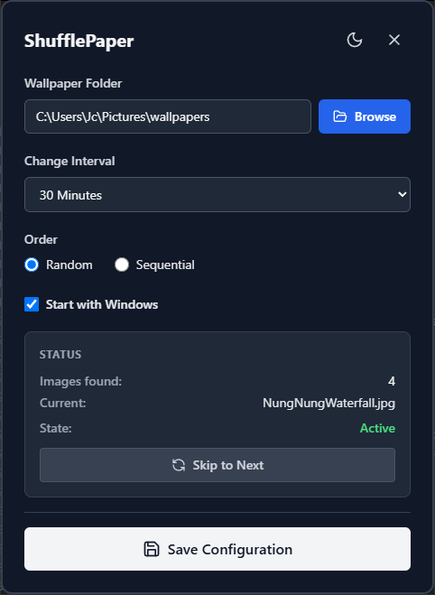

<p align="center">
  
</p>

# ShufflePaper



A lightweight, open-source wallpaper rotator for Windows. Automatically changes your desktop background from a local folder at configurable intervals. Zero telemetry, zero ads, zero accounts.

## Features

- Select a folder of wallpapers
- Configurable rotation intervals (1 minute to 24 hours)
- Shuffle or Sequential rotation mode
- Next / Previous manual controls
- Start with Windows (togglable)
- Lives in the system tray with quick menu
- Privacy-friendly: no network, no telemetry

## Prerequisites

- [Node.js](https://nodejs.org/) (>= 16)
- [Rust](https://www.rust-lang.org/) (>= 1.70)
- Cargo
- Visual Studio Build Tools / MSVC (for Rust `windows` crate on Windows)

## Dependencies

- **Frontend**: Vue 3, TypeScript, Vite, Tailwind CSS
- **Backend**: Tauri v2, Rust
- **Rust crates**: `windows`, `serde`, `serde_json`, `rand`
- **Tauri plugins**: `tauri-plugin-dialog`, `tauri-plugin-autostart`

## Installation

```powershell
git clone <repo-url>
cd WallpaperShuffle
npm install
```

## Run in Development

```powershell
npm run tauri dev
```

This starts the Vite dev server and launches the Tauri app in debug mode.

## Build for Production

```powershell
npm run tauri build
```

The installer / executable will be generated in `src-tauri/target/release/`.

## Usage

1. Click **Browse** to select a folder containing wallpapers (jpg, jpeg, png, bmp, webp).
2. Choose a rotation interval from the dropdown.
3. Select **Shuffle** or **Sequential** mode.
4. Enable **Start with Windows** if you want the app to launch on boot.
5. Click **Save**.
6. Use the system tray icon for quick access: Next Wallpaper, Pause / Resume, Settings, Exit.

## Project Structure

```
wallpaper-shuffle/
├── src-tauri/
│   └── src/
│       ├── commands.rs   # Tauri IPC commands
│       ├── main.rs
│       ├── lib.rs
│       ├── scheduler.rs  # Background rotation loop
│       ├── scanner.rs    # Folder image scanner
│       ├── settings.rs   # Config load / save
│       ├── tray.rs       # System tray menu
│       ├── state.rs      # App state (Mutex)
│       └── wallpaper.rs  # Windows wallpaper API
├── src/
│   └── App.vue           # Main Vue UI
├── package.json
├── vite.config.ts
├── tauri.conf.json
└── README.md
```

## License

MIT
