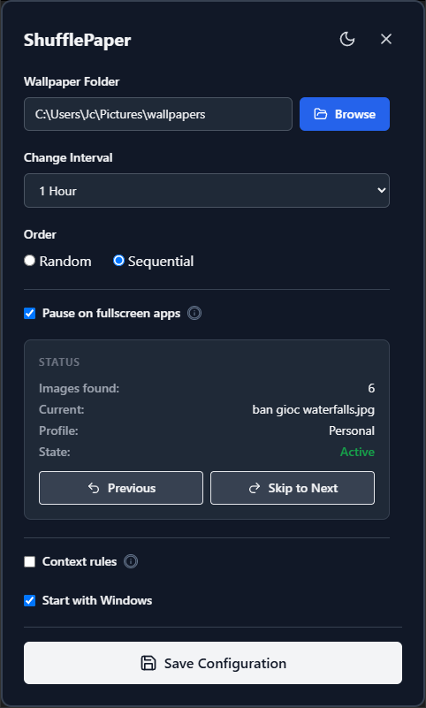
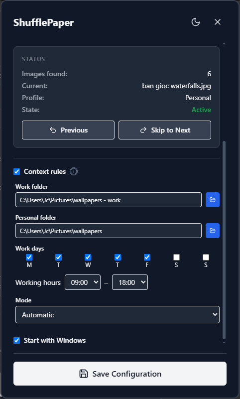

<p align="center">
  
</p>

# ShufflePaper



<p>
  <a href="https://github.com/jcsm/ShufflePaper/releases/latest">
    
  </a>
  <a href="https://github.com/jcsm/ShufflePaper/releases/latest">Download here</a>
</p>

## Features

- Select a folder of wallpapers
- Configurable rotation intervals (1 minute to 24 hours)
- Shuffle or Sequential rotation mode
- Shuffle mode never repeats an image until all have been shown once (Windows' built-in slideshow can't do this)
- **SVG wallpaper support** — SVG files are rasterized to a screen-resolution PNG and cached, including embedded CSS styling and system-font text (animations are not supported; see below)
- Next / Previous manual controls with undo history (also in the tray menu)
- Start with Windows (togglable)
- Smart fullscreen pause for games, videos, and presentations
- Work / Personal context profiles with schedules and tray overrides
- Fixed-height settings window with internal scrolling
- Lives in the system tray with quick menu
- Privacy-friendly: no network, no telemetry

## Prerequisites

- [Node.js](https://nodejs.org/) (>= 16)
- [Rust](https://www.rust-lang.org/) (>= 1.70)
- Cargo
- Visual Studio Build Tools / MSVC (for Rust `windows` crate on Windows)

## Dependencies

- **Frontend**: Vue 3, TypeScript, Vite, Tailwind CSS
- **Backend**: Tauri v2, Rust
- **Rust crates**: `windows`, `serde`, `serde_json`, `rand`, `chrono`, `resvg` (SVG rendering)
- **Tauri plugins**: `tauri-plugin-dialog`, `tauri-plugin-autostart`

## Installation

```powershell
git clone https://github.com/jcsm/ShufflePaper.git
cd ShufflePaper
npm install
```

## Run in Development

```powershell
npm run tauri dev
```

This starts the Vite dev server and launches the Tauri app in debug mode.

## Build for Production

```powershell
npm run tauri build
```

The installer / executable will be generated in `src-tauri/target/release/`.

## Usage

1. Click **Browse** to select a folder containing wallpapers (jpg, jpeg, png, bmp, webp, svg).
2. Choose a rotation interval from the dropdown.
3. Select **Shuffle** or **Sequential** mode.
4. Optionally enable **Pause on fullscreen apps** to stop automatic rotations while Windows detects a fullscreen game, video, presentation, or other busy fullscreen activity.
5. Optionally enable **Context rules** to use separate wallpaper folders for Work and Personal profiles.
6. Enable **Start with Windows** if you want the app to launch on boot.
7. Click **Save Configuration**.
8. Use the system tray icon for quick access: Next Wallpaper, Previous Wallpaper, Pause / Resume, profile override, Settings, and Exit.

### Context rules



When **Context rules** is enabled, ShufflePaper selects the wallpaper folder based on the current profile:

- During selected work days and working hours, wallpapers are selected from the **Work folder**.
- Outside working hours and on non-working days, wallpapers are selected from the **Personal folder**.
- Work days default to Monday through Friday.
- Working hours default to 09:00–18:00.
- The **Mode** selector supports `Automatic`, `Force Work`, and `Force Personal`.
- A forced profile remains active until `Automatic` is selected again, regardless of the schedule.
- If a profile folder is not configured, ShufflePaper falls back to the main **Wallpaper Folder** so the existing single-folder workflow continues to work.

The active profile is shown in the **Status** panel. The same profile override is available from the system tray under **Profile**.

### Fullscreen pause

When **Pause on fullscreen apps** is enabled, ShufflePaper uses Windows notification-state detection rather than window-size comparisons. If Windows reports a fullscreen Direct3D game, presentation mode, or busy fullscreen activity, the current rotation tick is skipped without queuing a pending wallpaper change. Rotation resumes on the next normal interval after fullscreen activity ends.

## Project Structure

```
ShufflePaper/
├── src-tauri/
│   └── src/
│       ├── commands.rs   # Tauri IPC commands
│       ├── main.rs
│       ├── lib.rs
│       ├── scheduler.rs  # Background rotation loop
│       ├── context.rs    # Work / Personal profile selection
│       ├── fullscreen.rs # Windows fullscreen-state detection
│       ├── logging.rs    # Persistent log file and panic hook
│       ├── scanner.rs    # Folder image scanner
│       ├── settings.rs   # Config load / save
│       ├── tray.rs       # System tray menu
│       ├── state.rs      # App state (Mutex)
│       └── wallpaper.rs  # Windows wallpaper API
├── src/
│   └── App.vue           # Main Vue UI
├── package.json
├── vite.config.ts
├── tauri.conf.json
└── README.md
```

## Logs

ShufflePaper writes a log to `%LOCALAPPDATA%\ShufflePaper\logs\shufflepaper.log` (rotated at ~1 MB). It records startup settings, every applied wallpaper, pause/resume transitions, panics, and any failure to apply an image. The **Open log file** button in the status panel opens it. Include the log when reporting a rotation that stopped working.

## License

MIT
